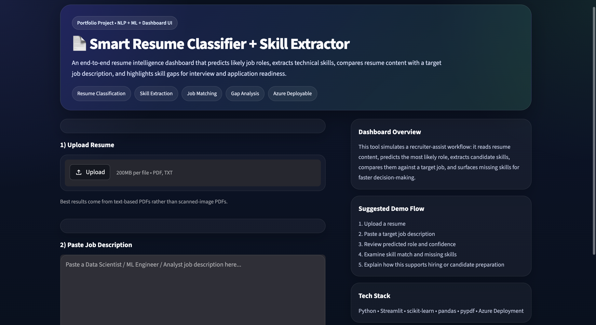
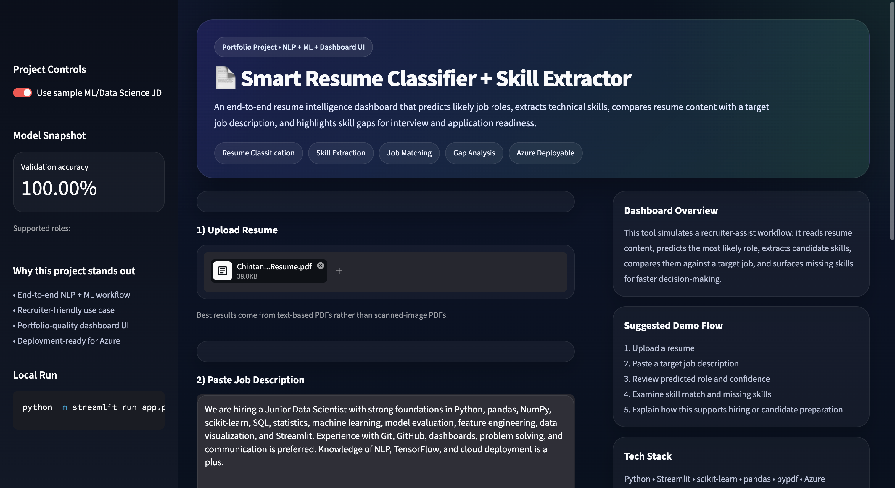
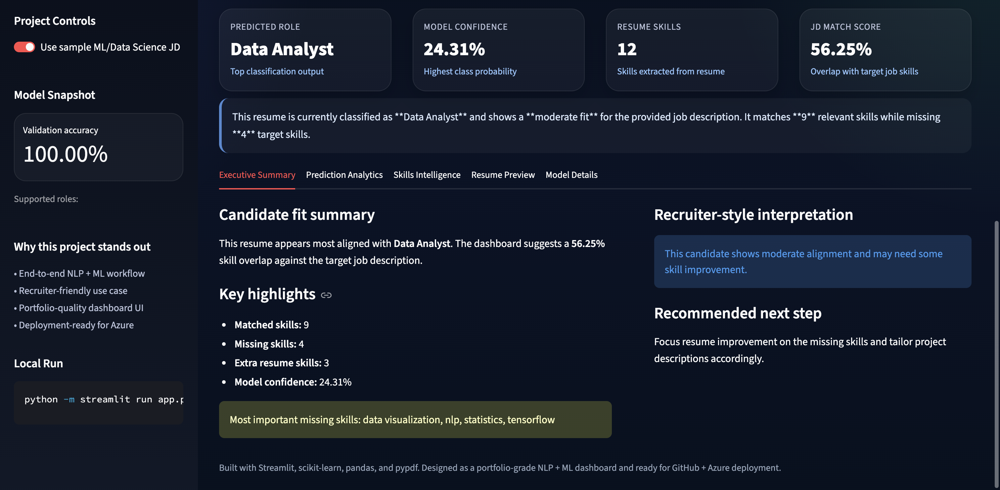
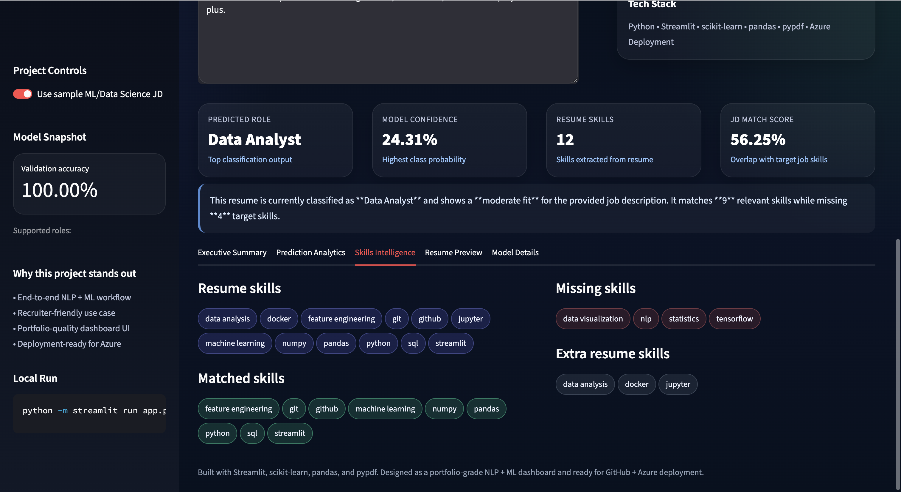

# 🚀 Smart Resume Classifier & Skill Extractor

<p align="center">
  <b>End-to-End NLP + Machine Learning Project with Deployment</b><br>
  Classify resumes, extract skills, match job descriptions, and identify skill gaps — all in a modern dashboard.
</p>

---

## 🌐 Live Demo

👉 **Try the App:**
🔗 https://resume-classifier-chintan.azurewebsites.net

---

## 👨‍💻 Author

**Chintan Patel**
🔗 GitHub: https://github.com/chintan-02
💼 LinkedIn: https://www.linkedin.com/in/chintan-patel-987765129/

---

## 📌 Project Overview

Recruiters spend significant time manually screening resumes.

👉 This project solves that problem by building an **AI-powered system** that:

* Classifies resumes into job roles
* Extracts relevant technical skills
* Compares resumes with job descriptions
* Identifies missing skills (**Skill Gap Analysis**)

All presented through a **clean, interactive dashboard UI**.

---

## ✨ Key Features

✅ Upload Resume (**PDF / TXT**)
✅ Automatic Text Extraction (NLP)
✅ Job Role Prediction (ML Model)
✅ Skill Extraction Engine
✅ Resume vs Job Description Matching
✅ Match Score Calculation
✅ Skill Gap Analysis (Missing Skills)
✅ Interactive Dashboard UI (Streamlit)

---

## 🧠 Tech Stack

| Category            | Tools                        |
| ------------------- | ---------------------------- |
| Language            | Python                       |
| Data Processing     | Pandas, NumPy                |
| NLP                 | NLTK / spaCy                 |
| Machine Learning    | scikit-learn                 |
| Feature Engineering | TF-IDF                       |
| Model               | Logistic Regression          |
| Deployment          | Streamlit, Azure App Service |
| Others              | pypdf                        |

---

## 🏗️ Project Architecture

```
Resume → Text Extraction → NLP Processing → TF-IDF → ML Model → Predictions
                                               ↓
                                   Skill Extraction Engine
                                               ↓
                              JD Matching + Skill Gap Analysis
```

---

## 📊 Screenshots

### 🖥️ Dashboard UI


Clean, modern UI for uploading resumes and navigating analysis.


### 📂 Resume Upload & User Interaction


Users can upload resumes and provide job descriptions to instantly analyze candidate fit in an interactive dashboard.

### 📊 Prediction Output


Model predicts job role with confidence score and provides recruiter-style interpretation.

### 🎯 Skill Gap Analysis


Highlights matched skills, missing skills, and areas for improvement.

---

## 📁 Project Structure

```
smart-resume-classifier-skill-extractor/
│
├── app.py
├── train.py
├── utils.py
├── requirements.txt
├── README.md
│
├── artifacts/
├── data/
├── deployment/
├── notebooks/
└── .streamlit/
```

---

## ⚙️ How It Works

1. Upload resume
2. Extract text from PDF/TXT
3. Clean & preprocess text
4. Convert text → TF-IDF features
5. Predict job role using ML model
6. Extract skills using keyword matching
7. Compare with job description
8. Generate:

   * Match Score
   * Matched Skills
   * Missing Skills

---

## 💻 Run Locally

```bash
git clone https://github.com/chintan-02/smart-resume-classifier
cd smart-resume-classifier

python3.11 -m venv venv
source venv/bin/activate

python -m pip install --upgrade pip
python -m pip install -r requirements.txt

python -m streamlit run app.py
```

👉 Open:

```
http://localhost:8501
```

---

## 🐳 Run With Docker

Build and start the Streamlit UI and FastAPI backend:

```bash
docker compose up --build
```

Open:

* Streamlit UI: http://localhost:8501
* FastAPI docs: http://localhost:8000/docs
* Health check: http://localhost:8000/health

Stop containers:

```bash
docker compose down
```

Reset the local Docker database volume:

```bash
docker compose down -v
```

Docker uses a local SQLite database stored in a Docker volume. No external AI API keys are required. The Streamlit app connects to the backend at `http://api:8000` inside Docker and can still fall back to local analysis if the API is unavailable.

---

## Model Evaluation & Registry

ResumeIQ includes a local model registry foundation for baseline classifier metadata, evaluation notes, and a simple model card.

Create or refresh the local baseline registry files:

```bash
python scripts/register_baseline_model.py
```

This writes local JSON metadata under `artifacts/model_registry/`.

The baseline model currently reports very high validation accuracy. Treat that as a review signal, not production proof. It should be checked later for data leakage, small validation split, class imbalance, overfitting, and real-resume calibration.

The registry stores model metadata and evaluation summaries only. It does not store full resume text, full job descriptions, or raw PII. MLflow or a cloud model registry can be added later when experiment tracking and deployment governance are introduced.

---

## Logging & Monitoring

ResumeIQ includes a local logging and monitoring foundation:

* FastAPI request IDs
* request timing headers
* safe structured logs
* database/API request metadata logging
* PII-safe logging rules

External monitoring tools such as Application Insights, Sentry, Prometheus, or Grafana are planned future integrations, not currently connected.

---

## CI/CD

ResumeIQ uses GitHub Actions to automatically run:

* dependency installation
* database initialization smoke test
* pytest test suite
* FastAPI import smoke test
* Docker Compose config validation
* Docker image build checks for the FastAPI backend and Streamlit UI

Workflow file:

```
.github/workflows/ci.yml
```

Status:

Runs on push and pull request to `main`.

Test locally before pushing:

```bash
pytest
python -m database.init_db
python - <<'PY'
from backend.main import app
print(app.title)
PY
docker compose config
docker compose build api
docker compose build streamlit
```

---

## 🔁 Retrain Model

```bash
python train.py
```

---

## 📓 Notebook (For Learning)

```bash
jupyter notebook
```

Open:

```
notebooks/Resume_Classifier_Project.ipynb
```

---

## ☁️ Deployment (Azure)

This project is deployed using **Azure App Service**.

Deployment includes:

* GitHub CI/CD integration
* Custom startup command
* Environment configuration

---

## 🚀 Future Improvements

* Deep Learning (BERT / Transformers)
* Advanced NER for skill extraction
* Multi-language resume support
* Resume ranking system
* Recruiter dashboard with analytics

---

## 📈 Why This Project Stands Out

✔ End-to-end ML pipeline
✔ Real-world use case
✔ Deployment on cloud (Azure)
✔ Clean UI/UX
✔ Business impact focused

---

## ⭐ Final Note

This project uses a **sample dataset for demonstration**.
For production-level performance, integrate a larger dataset and advanced NLP models.

---

<p align="center">
  ⭐ If you like this project, give it a star on GitHub!
</p>
